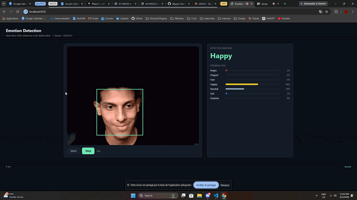

# Emotion Detection System



Real-time facial emotion detection system using deep learning and computer vision. Includes preprocessing, augmentation, model training, and live webcam inference via tkinter GUI and a FastAPI + WebSocket web demo.

## About

This project implements a CNN-based emotion detection system that can classify facial expressions into 7 different emotions:
- Angry (Colère)
- Disgust (Dégoût) 
- Fear (Peur)
- Happy (Joie)
- Neutral (Neutre)
- Sad (Tristesse)
- Surprise (Surprise)

## Features

- CNN model for emotion classification
- Real-time webcam emotion detection
- Data preprocessing and augmentation
- Model training with metrics visualization
- GUI application for live inference

## Project Structure

```
EmotionDetectionSystem/
├── CNN/                    # CNN model implementation
│   ├── cnn.py             # CNN model architecture
│   ├── app_cnn.py         # GUI application
│   ├── emotionCNN.pth     # Trained model weights
│   ├── metrics.png        # Training metrics
│   ├── predictions_cnn.csv # Model predictions
│   └── images/            # Emotion sample images
├── train/                 # Training data
│   ├── angry/            # Angry emotion images
│   ├── disgust/          # Disgust emotion images
│   ├── fear/             # Fear emotion images
│   ├── happy/            # Happy emotion images
│   ├── neutral/          # Neutral emotion images
│   ├── sad/              # Sad emotion images
│   └── surprise/         # Surprise emotion images
├── preprocess.py          # Data preprocessing
├── data_augmentation.py   # Data augmentation
├── model_training.ipynb   # Training notebook
└── requirements.txt       # Dependencies
```

## Installation

1. Clone the repository:
```bash
git clone https://github.com/Rayyan-Oumlil/EmotionDetectionSystem.git
cd EmotionDetectionSystem
```

2. Install dependencies:
```bash
pip install -r requirements.txt
```

## Usage

### Quick Start - Run the Application

**You can immediately run the emotion detection application with the pre-trained model:**

```bash
python CNN/app_cnn.py
```

This will launch a GUI application that uses your webcam for real-time emotion detection.

### Web Demo (FastAPI + WebSocket)

For a browser-based live demo, run:

```bash
uvicorn main:app --reload --app-dir web --host 0.0.0.0 --port 8000
```

Then open `http://localhost:8000` and click **Start**. The browser captures webcam frames and streams them over WebSocket (`/ws/emotion`); the server runs face detection + emotion inference and returns the predicted emotion, full probability distribution, and face bounding box for each frame.

Endpoints:
- `GET /` — demo page
- `GET /healthz` — model status + device
- `WS /ws/emotion` — binary in (JPEG bytes), JSON out

### Training Your Own Model

**To train a new model, you need a properly structured dataset:**

1. **Dataset Requirements:**
   - Organize your images in folders by emotion: `train/angry/`, `train/happy/`, etc.
   - Supported emotions: angry, disgust, fear, happy, neutral, sad, surprise
   - Images should be face images, preferably 48x48 pixels

2. **Training Process:**
   - Open `model_training.ipynb` in Jupyter Notebook
   - Run all cells to train the CNN model
   - Model will be saved in the CNN folder

## Dependencies

- Python 3.7+
- PyTorch (>=1.9.0)
- OpenCV (>=4.5.0)
- Pillow (>=8.0.0)
- NumPy (>=1.21.0)
- Pandas (>=1.3.0)
- Matplotlib (>=3.4.0)
- Scikit-learn (>=1.0.0)
- Tqdm (>=4.60.0)
- Jupyter Notebook (for training)

All dependencies are listed in `requirements.txt` and can be installed with:
```bash
pip install -r requirements.txt
```

## License

This project is licensed under the MIT License - see the LICENSE file for details.


## Contact

For questions or suggestions, please open an issue on GitHub.

---
